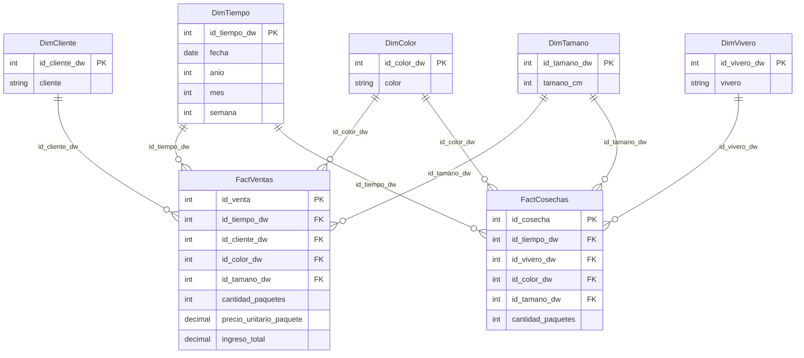

# [1.5] Diagrama del modelo dimensional (esquema estrella — Kimball)

Se ve dibujado en GitHub, en VS Code (extensión Mermaid) o pegando el bloque en https://mermaid.live

```mermaid
erDiagram
    DimTiempo ||--o{ FactVentas : "id_tiempo_dw"
    DimCliente ||--o{ FactVentas : "id_cliente_dw"
    DimColor ||--o{ FactVentas : "id_color_dw"
    DimTamano ||--o{ FactVentas : "id_tamano_dw"

    DimTiempo ||--o{ FactCosechas : "id_tiempo_dw"
    DimVivero ||--o{ FactCosechas : "id_vivero_dw"
    DimColor ||--o{ FactCosechas : "id_color_dw"
    DimTamano ||--o{ FactCosechas : "id_tamano_dw"

    FactVentas {
        int id_venta PK
        int id_tiempo_dw FK
        int id_cliente_dw FK
        int id_color_dw FK
        int id_tamano_dw FK
        int cantidad_paquetes
        decimal precio_unitario_paquete
        decimal ingreso_total
    }
    FactCosechas {
        int id_cosecha PK
        int id_tiempo_dw FK
        int id_vivero_dw FK
        int id_color_dw FK
        int id_tamano_dw FK
        int cantidad_paquetes
    }
    DimTiempo {
        int id_tiempo_dw PK
        date fecha
        int anio
        int mes
        int semana
    }
    DimCliente {
        int id_cliente_dw PK
        string cliente
    }
    DimColor {
        int id_color_dw PK
        string color
    }
    DimTamano {
        int id_tamano_dw PK
        int tamano_cm
    }
    DimVivero {
        int id_vivero_dw PK
        string vivero
    }
```
